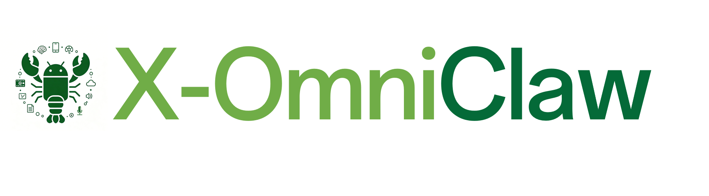
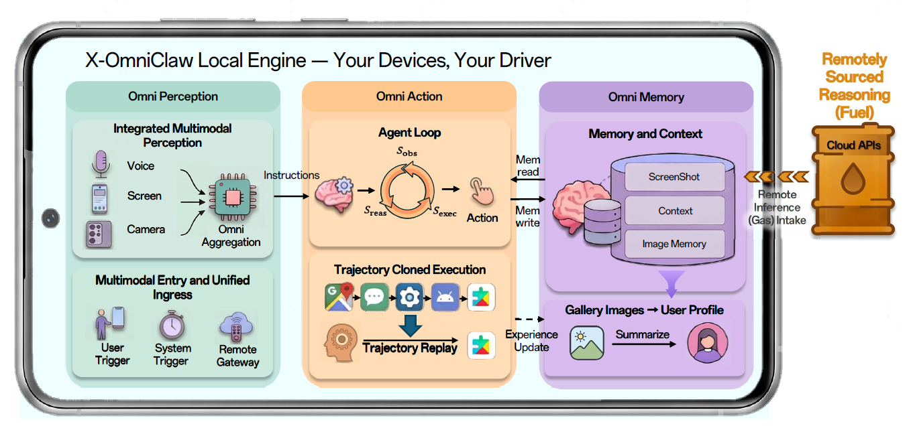

<div align="center">
  
  <p>
    <a href="https://github.com/OPPO-Mente-Lab/X-OmniClaw/releases/latest"></a>
    <a href="https://www.android.com/"></a>
    <a href="https://github.com/OPPO-Mente-Lab/X-OmniClaw/blob/main/LICENSE"></a>
    <a href="https://arxiv.org/abs/2605.05765"></a>
    <a href="assets/X_OmniClaw_Technical_Report__1_.pdf"></a>
    <a href="https://eggplant95.github.io/X-OmniClaw-Page/"></a>
    <a href="https://huggingface.co/papers/2605.05765"></a>
  </p>
</div>

<!-- **X-OmniClaw** 是一个集语音、视觉与执行于一体的 **多模态安卓端Agent**。它脱离了虚拟环境，能够直接部署在真实的安卓物理终端上，实时获取物理屏幕的视觉流并模拟原生触控交互，直接在真机上沿「感知-执行-优化」的逻辑循环推进。 -->

**X-OmniClaw** 是一个集多模态感知、记忆与执行于一体的 **多模态安卓端Agent**。它不依赖虚拟环境，而是直接运行在真实手机上，将屏幕界面、真实世界视觉和语音输入等转化为可执行任务，并通过端侧工具完成跨应用操作。**Omni** 表示系统整合三类感知来源：屏幕内的 UI 状态、屏幕外的真实世界视觉上下文，以及语音输入；**X-** 强调跨模态融合，将多源感知信号组织为统一的任务输入，并进一步驱动真实移动端环境中的跨应用执行。

**简体中文** · [English](README.md)

**[🧭 概览](#overview) | [📄 论文](#paper) | [💡 核心特性](#key-features) | [🎬 使用场景与录屏](#use-cases-demo) | [🔧 技能与工具](#skills-tools) | [🤖 模型](#models) | [🚀 快速开始](#quick-start) | [🛠️ 源码构建](#build-from-source) | [📄 许可证](#license) | [🙏 致谢](#acknowledgments)**

---

## 📢 动态

- **2026-04-22** 🧠 执行策略收敛：确立「纯文本可本地直返、凡设备操作统一走智能体」的主路径，并增强跨包 `ref` 安全重绑定与错误定位日志。
- **2026-04-20** 🧵 多会话并行落地：会话级独立智能体主循环、跨会话运行态隔离与精确停止链路上线，显著提升长任务稳定性。
- **2026-03-31** ⏰ 定时自动化可用：支持按间隔、工作日或周计划执行任务，覆盖息屏与亮屏场景。
- **2026-03-25** 🎙️ 语音视觉主链路成型：本地语音视觉闭环（录音、视觉帧、决策与执行）打通，语音与文本进入统一执行核心。
- **2026-03-14** 🛠️ 核心运行时重构：统一设备工具落地（快照、操作、打开应用、截图等），并对齐 OpenClaw 关键运行时能力。

---

<a id="paper"></a>
## 📄 论文

<!-- - arXiv：[https://arxiv.org/abs/XXXX.XXXXX](https://arxiv.org/abs/XXXX.XXXXX) -->
- 项目主页：[https://eggplant95.github.io/X-OmniClaw-Page/](https://eggplant95.github.io/X-OmniClaw-Page/)
- Hugging Face Papers：[2605.05765](https://huggingface.co/papers/2605.05765)
- arXiv：[https://arxiv.org/abs/2605.05765](https://arxiv.org/abs/2605.05765)
- 仓库内 PDF：[X-OmniClaw 技术报告](assets/X_OmniClaw_Technical_Report__1_.pdf)

---

<a id="overview"></a>
## 🧭 概览



**X-OmniClaw** 定位为手机端侧的 **多模态安卓端 Agent**。下文用表格归纳其 **执行型方法论**、**四层架构** 与 **三大核心能力**。

### 1. 执行方法论：从「对话」转向「执行」

为确保在复杂移动端 GUI 环境下的任务达成，在具体设备操作中，X-OmniClaw 将每一步界面交互组织为「观察 → 推理 → 执行」的最小循环：先观察当前页面和上一动作结果，再推理下一步动作，最后调度 Android 原子操作完成执行。该循环会不断重复，直到任务完成或被停止。

<table style="width:100%; border-collapse:collapse; border:1px solid #d0d7de; table-layout:fixed; margin-bottom:12px;">
<colgroup>
<col style="width:18%">
<col style="width:82%">
</colgroup>
<thead>
<tr style="background:#f6f8fa; border-bottom:1px solid #d0d7de;">
<th align="left" style="padding:8px 12px;">阶段</th>
<th align="left" style="padding:8px 12px;">描述</th>
</tr>
</thead>
<tbody>
<tr style="border-bottom:1px solid #eef1f4;"><td style="padding:8px 12px; vertical-align:top;"><strong>观察</strong></td><td style="padding:8px 12px;">通过系统快照、实时截图或无障碍树（Accessibility Tree）获取当前界面状态。该观察用于判断上一执行步骤的结果，并为后续执行提供决策证据。</td></tr>
<tr style="border-bottom:1px solid #eef1f4;"><td style="padding:8px 12px; vertical-align:top;"><strong>推理</strong></td><td style="padding:8px 12px;">LLM/VLM 理解当前页面，检查上一动作状态，按需检索相关记忆，选择合适的技能或工具，并决定直接回答还是继续执行。</td></tr>
<tr><td style="padding:8px 12px; vertical-align:top;"><strong>执行</strong></td><td style="padding:8px 12px;">通过 Android 原子动作调度具体操作，包括点击、滑动、文本输入和应用切换等。</td></tr>
</tbody>
</table>

### 2. 系统技术架构：四层闭环驱动

在系统级，通过「感知 → 策略 → 执行 → 验收」实现全链路闭环。感知层汇聚多模态输入，策略层形成任务计划，执行层调度设备动作，验收层检查结果并判断是否继续。

<table style="width:100%; border-collapse:collapse; border:1px solid #d0d7de; table-layout:fixed; margin-bottom:12px;">
<colgroup>
<col style="width:14%">
<col style="width:24%">
<col style="width:62%">
</colgroup>
<thead>
<tr style="background:#f6f8fa; border-bottom:1px solid #d0d7de;">
<th align="left" style="padding:8px 12px;">架构层</th>
<th align="left" style="padding:8px 12px;">核心组件</th>
<th align="left" style="padding:8px 12px;">职责定义</th>
</tr>
</thead>
<tbody>
<tr style="border-bottom:1px solid #eef1f4;"><td style="padding:8px 12px; vertical-align:top;">感知层</td><td style="padding:8px 12px; vertical-align:top;"><strong>Multi-modal Input</strong></td><td style="padding:8px 12px;">融合语音识别（ASR）、截图/录屏帧、无障碍树信息，构建统一感知上下文。</td></tr>
<tr style="border-bottom:1px solid #eef1f4;"><td style="padding:8px 12px; vertical-align:top;">策略层</td><td style="padding:8px 12px; vertical-align:top;"><strong>Agent Loop</strong></td><td style="padding:8px 12px;">智能体主循环：任务拆解；通过 Kotlin 桥接进行分发。</td></tr>
<tr style="border-bottom:1px solid #eef1f4;"><td style="padding:8px 12px; vertical-align:top;">执行层</td><td style="padding:8px 12px; vertical-align:top;"><strong>Device Scheduler</strong></td><td style="padding:8px 12px;">快照、模拟 UI 操作和应用生命周期管理。</td></tr>
<tr><td style="padding:8px 12px; vertical-align:top;">验收层</td><td style="padding:8px 12px; vertical-align:top;"><strong>Success Monitor</strong></td><td style="padding:8px 12px;">执行后的检查与循环检测，用于判断偏移或完成。</td></tr>
</tbody>
</table>

### 3. X-OmniClaw 三大核心能力

X-OmniClaw 围绕感知、记忆与行动三个模块组织系统能力，支撑真实应用任务。

<table style="width:100%; border-collapse:collapse; border:1px solid #d0d7de; table-layout:fixed; margin-bottom:12px;">
<colgroup>
<col style="width:14%">
<col style="width:24%">
<col style="width:62%">
</colgroup>
<thead>
<tr style="background:#f6f8fa; border-bottom:1px solid #d0d7de;">
<th align="left" style="padding:8px 12px;">核心能力</th>
<th align="left" style="padding:8px 12px;">核心优化点</th>
<th align="left" style="padding:8px 12px;">技术实现</th>
</tr>
</thead>
<tbody>
<tr style="border-bottom:1px solid #eef1f4;"><td style="padding:8px 12px; vertical-align:top;"><strong>Omni Perception（全感知）</strong></td><td style="padding:8px 12px; vertical-align:top;">统一多模态入口与意图理解</td><td style="padding:8px 12px;">整合 UI 状态、真实世界视觉上下文、语音输入、定时触发、悬浮组件和外部渠道；通过时间对齐与场景化 VLM 理解，将原始输入流转化为结构化意图。</td></tr>
<tr style="border-bottom:1px solid #eef1f4;"><td style="padding:8px 12px; vertical-align:top;"><strong>Omni Memory（全记忆）</strong></td><td style="padding:8px 12px; vertical-align:top;">多模态个性化记忆</td><td style="padding:8px 12px;">结合用于任务连续性的工作记忆，以及从本地多模态数据中蒸馏出的长期个人记忆，支持个性化多轮交互和记忆驱动的自动化执行。</td></tr>
<tr><td style="padding:8px 12px; vertical-align:top;"><strong>Omni Action（全行动）</strong></td><td style="padding:8px 12px; vertical-align:top;">稳健执行与可复用技能</td><td style="padding:8px 12px;">围绕混合 UI 证据运行观察-推理-执行循环，并通过行为克隆和轨迹回放将用户导航转化为可复用的 deeplink/intent 技能。</td></tr>
</tbody>
</table>

---

<a id="key-features"></a>
## 💡 核心特性

- **端侧可执行智能体闭环**：多轮任务不是一次性问答，而是带预算与循环检测的执行循环，会在失败时收敛并继续推进。
- **过程与成本可观测**：执行过程可实时输出（步骤、思考、工具调用与结果等），并对大模型用量做累计，便于界面侧展示。
- **统一设备工具入口**：界面理解、点击输入、打开应用、截图与剪贴板等操作走同一套设备工具，并内置稳定性与误触保护。
- **视觉兜底与双轨决策**：优先结构化理解，同时在复杂页面或弱结构场景下可用视觉兜底降低误操作。
- **语音到执行的一体链路**：语音识别后结合屏幕画面理解意图，并能把「按下说话那一刻」的画面对齐到决策输入。
- **相册与媒体场景能力**：支持把相册内容纳入「可检索、可总结、可执行」的工作流（例如按问题查图、做记忆整理，并串到剪映类一键成片等场景）。
- **深度链接与可复现流程（在能力可用时）**：可维护深度链接与收藏，把长路径或反复操作压缩成可复用的一键入口，适合「录一次、下次一句话直达」。
- **多会话并行与可控停止**：支持并行会话互不干扰，并可按会话中断任务。

---

<a id="use-cases-demo"></a>
## 🎬 使用场景与录屏

### 三条演示主线 / 四个演示

<!-- 每排 2 列（各占 50%），共两排展示 4 个 demo；动图为 GIF，使用 videos/ 相对路径 -->
<table width="100%">
<colgroup>
<col width="50%">
<col width="50%">
</colgroup>
<thead>
<tr style="background:#f6f8fa; border-bottom:1px solid #d0d7de;">
<th align="left" width="50%">📷 Demo A1 — 相机感知执行</th>
<th align="left" width="50%">📺 Demo A2 — 屏幕替身 / 屏幕伴随</th>
</tr>
</thead>
<tbody>
<tr style="vertical-align:top; border-bottom:1px solid #eef1f4;">
    <td style="padding:8px 12px;"><strong>用户指令</strong><br>「这瓶水在淘宝上卖多少钱」</td>
    <td style="padding:8px 12px;"><strong>用户指令</strong><br>「开始做题吧。」</td>
</tr>
<tr style="vertical-align:top; border-bottom:1px solid #eef1f4;">
    <td style="padding:8px 12px;">
        <strong>执行特征</strong><br>
        • 看相机画面 + 听语音，先判断“这是啥、要查什么”<br>
        • 自动一键进入目标 App 的搜索页（如淘宝）<br>
        • 结果页自动滚动截图并提取价格/销量，给出带数字结论
    </td>
    <td style="padding:8px 12px;">
        <strong>执行特征</strong><br>
        • 跟随当前投屏/界面作为主视角，切哪页跟哪页<br>
        • 用户按住语音后启动执行，结合屏幕内容理解任务<br>
        • 长任务按步骤连续推进，边执行边看反馈并动态调整
    </td>
</tr>
<tr style="vertical-align:top; border-bottom:1px solid #eef1f4;">
    <td style="padding:8px 12px;"><strong>相机识物</strong> → <strong>电商询价</strong>闭环。</td>
    <td style="padding:8px 12px;"><strong>屏幕伴侣跟随</strong> → <strong>多步读屏自动作答</strong>。</td>
</tr>
<tr style="vertical-align:top;">
    <td style="padding:8px 12px;">
        
    </td>
    <td style="padding:8px 12px;">
        
    </td>
</tr>
</tbody>
</table>

<table width="100%">
<colgroup>
<col width="50%">
<col width="50%">
</colgroup>
<thead>
<tr style="background:#f6f8fa; border-bottom:1px solid #d0d7de;">
<th align="left" width="50%">✂️ Demo B — 记忆驱动的一键成片</th>
<th align="left" width="50%">📦 Demo C — 直达美团秒杀页（行为克隆）</th>
</tr>
</thead>
<tbody>
<tr style="vertical-align:top; border-bottom:1px solid #eef1f4;">
    <td style="padding:8px 12px;"><strong>用户指令</strong><br>「帮我找到与鹦鹉主题相关的照片并一键成片。」</td>
    <td style="padding:8px 12px;"><strong>用户指令</strong><br>「打开美团秒杀」</td>
</tr>
<tr style="vertical-align:top; border-bottom:1px solid #eef1f4;">
    <td style="padding:8px 12px;">
        <strong>执行特征</strong><br>
        • 先在后台把相册内容整理成“可按主题检索”的记忆清单，再按你说的“鹦鹉”挑出候选照片<br>
        • 把选中的图先集中到一个临时相册（如 <code>A_latest</code>），避免在全相册里一张张翻找<br>
        • 自动跳到剪映一键成片页，批量勾选这些照片，必要时点“跳过分析”，最后进入导出/分享
    </td>
    <td style="padding:8px 12px;">
        <strong>执行特征</strong><br>
        • 录一次轨迹，沉淀成可复用书签/技能（含页面启动信息）<br>
        • 之后一句话即可直达目标页（如“打开美团秒杀”）<br>
        • 启动失败时自动降级兜底，尽量回到上次具体页面
    </td>
</tr>
<tr style="vertical-align:top; border-bottom:1px solid #eef1f4;">
    <td style="padding:8px 12px;"><strong>主题找图</strong> → <strong>一键成片</strong>。</td>
    <td style="padding:8px 12px;"><strong>录制一次轨迹</strong> → <strong>一句话直达目标页</strong>。</td>
</tr>
<tr style="vertical-align:top;">
    <td style="padding:8px 12px;">
        
    </td>
    <td style="padding:8px 12px;">
        
    </td>
</tr>
</tbody>
</table>

---

<a id="skills-tools"></a>
## 🔧 技能与工具

技能通过 `app/src/main/assets/skills/` 按需加载，执行经工具（含 `device`）落到界面。

### 🗂️ 随包技能（共 10 个）

路径：`app/src/main/assets/skills/<技能名>/SKILL.md`。

| 类别 | 技能标识 |
| :--- | :--- |
| **搜索与应用** | `app-search`, `taobao-search` |
| **相册与媒体** | `gallery-qa`, `gallery-memory`, `capcut-theme-video`, `clipboard-to-shortcut` |
| **配置管理** | `model-config`, `channel-config` |
| **技能管理** | `skill-creator` |
| **自动化** | `scheduled-automation` |

### 🧪 各技能示例指令（可直接对智能体说）

| 技能标识 | 示例指令 |
| :--- | :--- |
| `app-search` | 「去小红书搜北京旅游攻略发给我。」 |
| `taobao-search` | 「淘宝搜『男士轻薄防晒衣』，按价格区间和销量给我推荐 3 个。」 |
| `gallery-qa` | 「我今天拍了什么照片？按时间顺序简单说一下。」 |
| `gallery-memory` | 「同步一下相册记忆并更新用户画像，先扫最近 20 张。」 |
| `clipboard-to-shortcut` | 「把剪贴板里的链接做成一个技能，名字叫『淘宝好物直达』。」 |
| `channel-config` | 「把飞书渠道配置好并启用，应用编号是 xxx，密钥是 xxx。」 |
| `model-config` | 「新增一个兼容OpenAI接口的提供商，接口地址是 xxx，默认模型设成 xxx。」 |
| `scheduled-automation` | 「每周三早上 10 点打开小红书搜索人工智能新闻并总结给我。」 |
| `capcut-theme-video` | 「把今天拍的风景图做成剪映一键成片。」 |
| `skill-creator` | 「帮我把刚刚执行成功的方法总结成新的技能，并生成对应的 SKILL.md。」 |

---

<a id="models"></a>
## 🤖 模型

**推荐方式：在 APK 内填写各线路 API Key 并保存**，应用会写入 `/sdcard/.xomniclaw/xomniclaw.json`，一般不必手工编辑 JSON。

### 应用内配置（推荐）

1. 打开应用，进入 **「模型配置」**（侧栏 / 设置；首次启动也可能出现向导）。
2. **Agent 主模型**：选择提供商 → 填写 **API Key**（若线路要求则填写 Base URL）→ 选择默认模型 → **保存**。
3. **语音 STT**：在同一页的 **STT** 入口进入配置页，填写语音转写服务的 **API Key**、接口地址与模型（如硅基流动 **SenseVoice Small**）；可与 Agent **使用不同密钥**。
4. **视觉 VLM**：进入 **VLM 配置**，填写截图 / 界面理解所用的多模态模型（须支持图像）；可与 Agent 同提供商或单独填写。
5. 保存成功后配置落盘；修改网关端口等可在 **设置** 或其它对应页面调整。

界面保存的内容与下文 JSON 字段一一对应；仅在做批量迁移、脚本生成或排查时再直接改文件。

### 内置 Provider 与示例模型 ID

| 提供商 ID | 示例模型 ID |
| :--- | :--- |
| `openrouter` | `Qwen 3.6 Flash` |
| `anthropic` | `claude-opus-4` |
| `openai` | `gpt-4.1` |
| `moonshot` | `kimi-k2.5` |
| `minimax` | `MiniMax-M2.5` |
| `ollama` | 无固定 ID（`/api/tags`） |

### 配置文件参考：Agent 主模型

与「模型配置」中选择的提供商 / 默认模型一致。

```json
{
  "models": {
    "providers": {
      "openrouter": {
        "baseUrl": "https://openrouter.ai/api/v1",
        "api": "openai-completions",
        "apiKey": "<OPENROUTER_API_KEY>",
        "models": [
          {
            "id": "qwen/qwen3.6-flash",
            "name": "Qwen 3.6 Flash",
            "contextWindow": 131072,
            "maxTokens": 8192
          }
        ]
      }
    }
  },
  "agents": {
    "defaults": {
      "model": {
        "primary": "openrouter/qwen/qwen3.6-flash"
      }
    }
  }
}
```

### 配置文件参考：语音 STT

对应「STT 配置」页。示例：**硅基流动** + **FunAudioLLM/SenseVoiceSmall**。  
硅基流动申请地址：[https://cloud.siliconflow.cn](https://cloud.siliconflow.cn)。  
当前示例语音 STT 线路可免费使用（以服务商当期免费额度/策略为准）。

```json
{
  "models": {
    "providers": {
      "stt": {
        "baseUrl": "https://api.siliconflow.cn/v1/audio/transcriptions",
        "api": "openai-completions",
        "apiKey": "<硅基流动 API Key>",
        "models": [
          {
            "id": "FunAudioLLM/SenseVoiceSmall",
            "name": "SenseVoice Small",
            "contextWindow": 1,
            "maxTokens": 1
          }
        ]
      }
    }
  }
}
```

### 配置文件参考：视觉 VLM

对应「VLM 配置」页。以下为 **OpenRouter** + OpenAI 兼容视觉模型的示例：

```json
{
  "models": {
    "providers": {
      "vlm": {
        "baseUrl": "https://openrouter.ai/api/v1",
        "api": "openai-completions",
        "apiKey": "sk-or-v1-xxx",
        "models": [
          {
            "id": "qwen/qwen3.6-flash",
            "name": "Qwen 3.6 Flash（经 OpenRouter）",
            "contextWindow": 200000,
            "maxTokens": 16384
          }
        ]
      }
    }
  }
}
```

---

<a id="quick-start"></a>
## 🚀 快速开始

### 📥 1）下载与安装

从发行版页面获取安装包：  
[https://github.com/OPPO-Mente-Lab/X-OmniClaw/releases/latest](https://github.com/OPPO-Mente-Lab/X-OmniClaw/releases/latest)

### ⚙️ 2）首次配置（优先用应用内表单）

1. 打开应用，完成 **「模型配置」**：填写 **Agent** 的 API Key 并选择支持**多模态（图像）**的默认模型；再按需进入 **STT**、**VLM** 分别填写密钥。  
2. 授予权限（与应用内检测一致，共 **7** 项）：**无障碍**，**悬浮窗**，**录屏**，**相册**，**全部文件访问**，**摄像头**，**麦克风**。  
3. 可选：在应用内配置 **飞书 / Discord** 等渠道。

### 📄 3）配置文件位置（自动生成）

保存上述界面选项后会生成或更新：

```text
/sdcard/.xomniclaw/xomniclaw.json
```

仅在备份、迁移或调试时需要直接查看该文件。

---

<a id="build-from-source"></a>
## 🛠️ 源码构建

### 📋 环境要求

- 不低于 JDK 17  
- 安卓软件开发工具包  
- Gradle 封装脚本（推荐）  

### 🔨 克隆与构建（示例）

```bash
git clone <你的 GitLab 仓库 URL>
cd X-OmniClaw
cp local.properties.example local.properties
# 编辑 local.properties，设置 sdk.dir 指向本机 Android SDK
./gradlew :app:assembleDebug
```

上游 GitHub 镜像（可选）：

```bash
git clone https://github.com/OPPO-Mente-Lab/X-OmniClaw.git
cd X-OmniClaw
```

Windows PowerShell 示例：

```powershell
$env:JAVA_HOME = "D:\path\to\jdk-17"
$env:ANDROID_HOME = "D:\path\to\android-sdk"
Set-Location "D:\path\to\X-OmniClaw"
Copy-Item local.properties.example local.properties
notepad local.properties
.\gradlew.bat :app:assembleDebug
```

输出安装包（示例路径）：

```text
releases/X-OmniClaw-v<version>-debug.apk
```

---

<a id="license"></a>
## 📄 许可证

采用 [Apache License 2.0](LICENSE)：商用与修改允许；须保留声明并标注改动。

---

<a id="acknowledgments"></a>
## 🙏 致谢

**[HermesApp](https://github.com/SelectXn00b/HermesApp)** ：本项目的工程实现最初基于此开源代码库进行初始化与演进，在此向 HermesApp 维护者与社区致以谢意。

---

## Star History

<a href="https://www.star-history.com/?repos=OPPO-Mente-Lab%2FX-OmniClaw&type=date&legend=top-left">
 <picture>
   <source media="(prefers-color-scheme: dark)" srcset="https://api.star-history.com/chart?repos=OPPO-Mente-Lab/X-OmniClaw&type=date&theme=dark&legend=top-left" />
   <source media="(prefers-color-scheme: light)" srcset="https://api.star-history.com/chart?repos=OPPO-Mente-Lab/X-OmniClaw&type=date&legend=top-left" />
   
 </picture>
</a>
